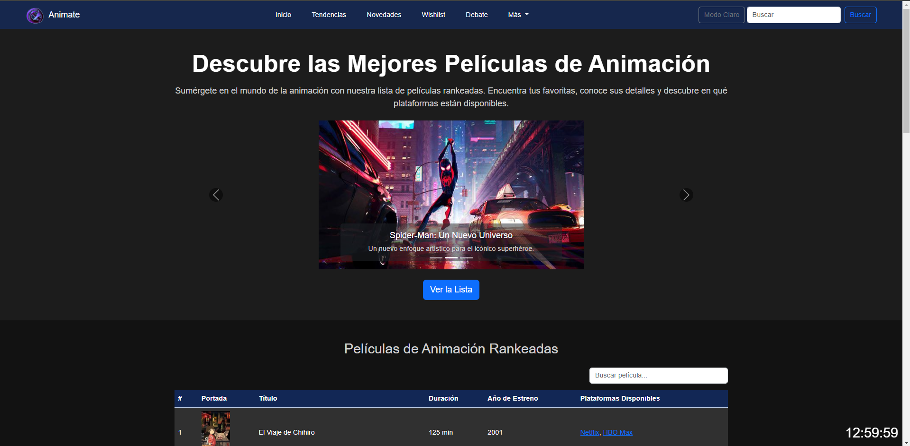
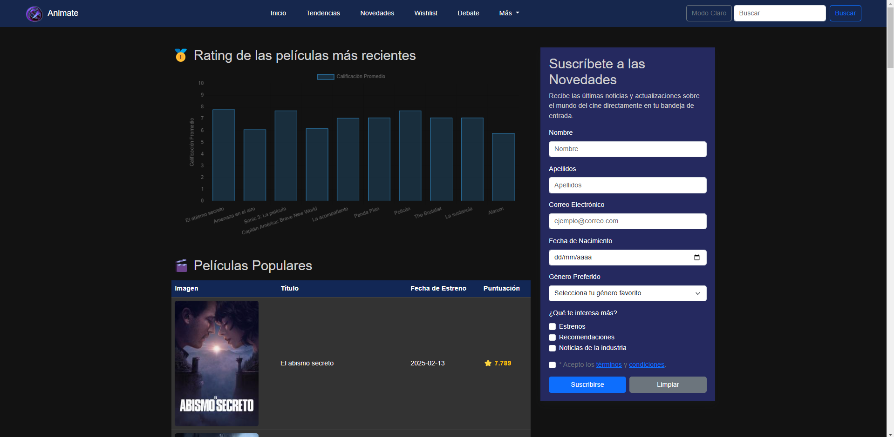
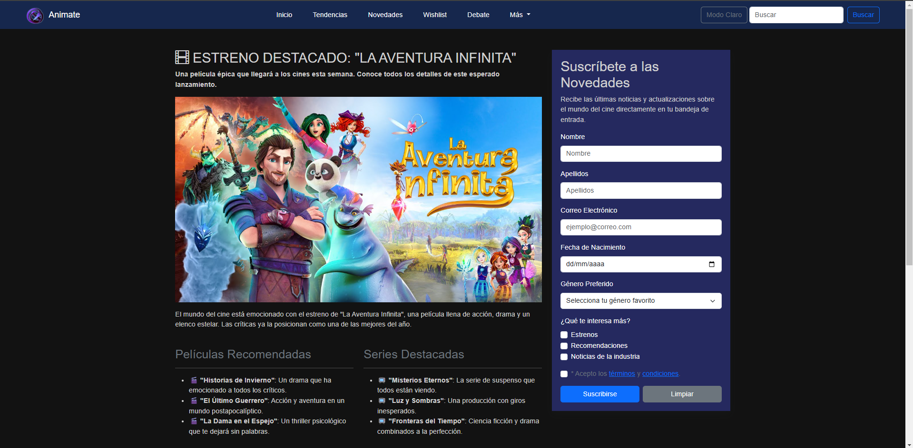
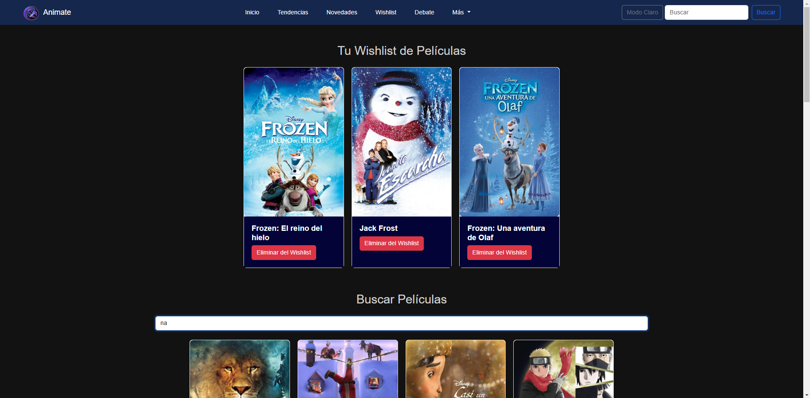
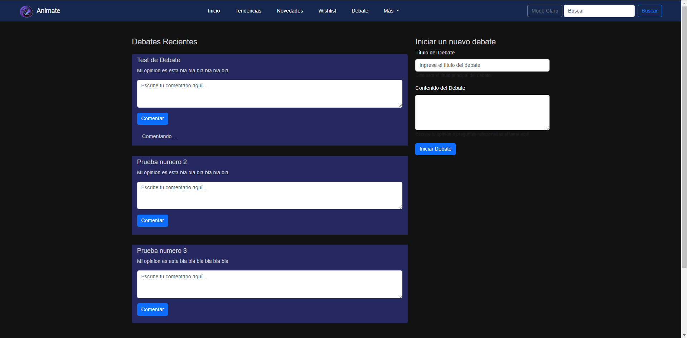

---

# Documentación de la Web: Animate

## Descripción
"Animate" es una plataforma para discutir, descubrir y gestionar películas y series, donde los usuarios pueden compartir sus opiniones, explorar tendencias y novedades, y mantener una lista personalizada de películas a través de la funcionalidad de wishlist.

## Tabla de Contenidos

- [Estructura del Proyecto](#estructura-del-proyecto)
- [Navegación por la web](#navegación)
- [Funcionalidades](#funcionalidades)
- [Tecnologías Usadas](#tecnologías-usadas)
- [Accesibilidad](#accesibilidad)
- [Licencia](#licencia)

---

## Estructura del Proyecto

El proyecto se estructura de la siguiente manera:

```
animate-web/
├── .gitattributes            # Configuraciones de Git
├── Documentacion.md          # Este archivo de documentación
├── README.md                 # Descripción general del proyecto
├── buscarTabla.js            # Lógica para la búsqueda y filtrado de películas
├── cambiarColor.js           # Lógica para el cambio de colores (modo oscuro/claro)
├── debate.css                # Estilos específicos para la página de debates
├── debate.html               # Página de debates
├── debate.js                 # Funcionalidad de los debates
├── grafico.js                # Lógica para gráficos (si aplica)
├── inicio.css                # Estilos específicos para la página de inicio
├── inicio.html               # Página de inicio
├── limpiar_notificacion.js   # Funcionalidad para limpiar notificaciones
├── modoOscuro.js             # Lógica para el modo oscuro
├── modoOscuroTendencias.js   # Lógica para el modo oscuro en la página de tendencias
├── novedades.html            # Página de novedades
├── peliculasPopulares.js     # Lógica para manejar películas populares
├── reloj.js                  # Lógica para mostrar y actualizar reloj (si aplica)
├── tendencias.css            # Estilos específicos para la página de tendencias
├── tendencias.html           # Página de tendencias
├── validaciones.js           # Lógica para validaciones de formularios y entradas
├── wishlist.css              # Estilos específicos para la página de wishlist
├── wishlist.html             # Página de wishlist
├── wishlist.js               # Funcionalidad para el manejo de wishlist
```

---

## Navegación por la web

### Inicio


### Tendencias


### Novedades


### Wishlist


### Debate


---


## Funcionalidades

### 1. **Consulta de la Tabla de Películas Favoritas**
   - Los usuarios pueden acceder a una tabla que muestra sus películas favoritas. Esta funcionalidad permite gestionar las películas que más les gustan, agregarlas a una lista personalizada y consultarlas fácilmente. La lista de películas se muestra de forma organizada y clara, utilizando un diseño accesible y fácil de usar.

### 2. **Listado de Películas Recomendadas desde una API**
   - La web se conecta con una API externa que proporciona un listado de películas recomendadas. Estas películas son obtenidas y presentadas en una interfaz de usuario limpia y fácil de navegar. Los usuarios pueden explorar nuevas películas basadas en sus intereses o preferencias.

### 3. **Gráfico de Calificaciones de las Películas Más Recientes**
   - Un gráfico interactivo visualiza las calificaciones de las películas más recientes. Los usuarios pueden ver cómo se han calificado las películas populares en una representación gráfica clara, ayudándoles a obtener una perspectiva rápida sobre la aceptación general de las últimas películas lanzadas.

### 4. **Formulario de Registro**
   - La web incluye un formulario de registro para que los usuarios creen una cuenta. El formulario recopila información básica como nombre, correo electrónico y contraseña. Se validan los campos para garantizar que los datos proporcionados sean correctos antes de completar el registro.

### 5. **Lista de Deseos (Wishlist)**
   - Los usuarios pueden buscar cualquier película y agregarla a su lista de deseos (wishlist). Esta funcionalidad permite mantener una lista personal de películas que el usuario desea ver en el futuro. Se incluye un buscador para facilitar la adición de nuevas películas a la wishlist. Las películas agregadas se gestionan y se presentan de manera sencilla.

### 6. **Sección de Debate**
   - Los usuarios pueden participar en debates sobre diversos temas relacionados con el cine. La sección permite iniciar un nuevo debate, publicar comentarios y responder a otros usuarios. Esta funcionalidad fomenta la interacción y el intercambio de opiniones dentro de la comunidad de la web.

### 7. **Diseño Responsivo**
   - La web está diseñada para ser completamente responsiva. Esto significa que se adapta automáticamente a diferentes tamaños de pantalla, proporcionando una experiencia de usuario fluida y optimizada en dispositivos móviles, tabletas y escritorios.

### 8. **Modo Oscuro/Claro**
   - La web incluye un botón para cambiar entre modo oscuro y claro, permitiendo a los usuarios elegir la apariencia que prefieren para la interfaz. Esta funcionalidad no solo mejora la accesibilidad, sino que también ofrece una experiencia visual personalizada y cómoda para los usuarios en diferentes condiciones de iluminación.

---

## Tecnologías Usadas

- **HTML5**: Estructura de la página.
- **CSS3**: Estilo visual y diseño responsivo.
- **JavaScript**: Interactividad en la página (búsqueda de películas, funcionalidad de debates, etc.).
- **Bootstrap 5**: Framework CSS para diseño responsivo y componentes interactivos (barra de navegación, botones, formularios).
- **Font Awesome**: Iconos para mejorar la interfaz de usuario.

---

## Accesibilidad

Se han implementado varias prácticas para mejorar la accesibilidad de la web:

1. **Etiquetas `aria`**: Se utilizan para mejorar la interacción con tecnologías asistivas, como lectores de pantalla. Ejemplo: `aria-label`, `aria-labelledby`, `aria-required`, `aria-describedby`.

2. **Estructura Semántica**: El uso adecuado de etiquetas HTML semánticas como `<header>`, `<main>`, `<nav>`, `<article>`, etc., para mejorar la comprensión del contenido.

3. **Controles de Formulario Accesibles**: Todos los formularios tienen etiquetas `label` adecuadas y descripciones de los campos con `aria-describedby`.

4. **Modo Oscuro/Claro**: Botón accesible para permitir a los usuarios cambiar entre modos.

---

## Licencia

Este proyecto está bajo la licencia.